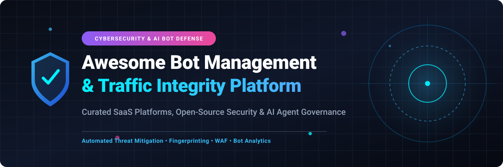

  

# 🛡️ Awesome Bot Management Platform

> **Curated List of Commercial SaaS Products, Open-Source Security Solutions, AI Agent Governance & Traffic Integrity Platforms**

   

---

## 📌 Executive Overview & Market Context

The global **Bot Management Market** size is estimated at **~$5.2 Billion in 2026** and projected to expand to **~$11.8 Billion by 2032** at a **Compound Annual Growth Rate (CAGR) of 14.8%**.

### 📊 Market Structure & Fragmentation Dynamics
The bot mitigation sector is **moderately fragmented**:
* **Mega-Cap Cloud & CDN Edge Leaders** (*Cloudflare, Akamai, F5, Imperva/Thales*) integrate bot management natively into edge infrastructure and WAFs.
* **Specialized Pure-Play Cybersecurity Vendors** (*DataDome, HUMAN Security, Kasada, Radware, Netacea*) compete on advanced behavioral AI, agentic LLM traffic governance, zero-latency verification, and low false-positive challenges.
* **Open-Source Ecosystem** focuses heavily on signature parsing (User-Agent/JA3), client fingerprinting, and proxy micro-agents.

---

## 📑 Table of Contents

- [🛡️ Executive Overview \& Market Context](#-executive-overview--market-context)
- [💼 Commercial SaaS Bot Protection Platforms](#-commercial-saas-bot-protection-platforms)
- [💻 Open-Source Bot Detection Projects](#-open-source-bot-detection-projects)
- [🧱 Architecture Framework for Custom Bot Defense](#-architecture-framework-for-custom-bot-defense)
- [🤝 How to Contribute](#-how-to-contribute)
- [⚠️ Disclaimer](#️-disclaimer)
- [📈 Star History](#-star-history)
- [☕ Support \& Sponsorship](#-support--sponsorship)

---

## 💼 Commercial SaaS Bot Protection Platforms

Below is the comparative breakdown of top commercial Bot Management platforms, sorted by **Company Size / Valuation (Descending)**:

| 🏢 Product / Platform | 📝 Key Capabilities & Description | 💰 Pricing (Starting Tier) | 🎁 Free Tier / Trial Limit | 📊 Company Size / Valuation |
| :--- | :--- | :--- | :--- | :--- |
| **[Cloudflare Bot Management](https://www.cloudflare.com/products/bot-management/)** | Edge-integrated detection using global machine learning, JA3/JA4 fingerprinting, and granular bot scores (1–99). | Starting at ~$5,000 / month (Enterprise tier contract) | Free "Bot Fight Mode" on Free plan (basic automated host blocking) | **~$115.0 Billion Market Cap** (NYSE: NET, ~$2.7B Rev) |
| **[Imperva Advanced Bot Protection](https://www.imperva.com/products/advanced-bot-protection-management/)** | Multi-layered defense covering OWASP Top 21 automated threats, direct client interrogation, and AI crawler governance. | Starting at ~$1,200 / month | 30-Day Free Trial (up to 100,000 requests evaluated) | **~$32.0 Billion Market Cap** (Parent Thales / ~$3.6B Acquisition) |
| **[Akamai Bot Manager](https://www.akamai.com/products/bot-manager)** | Edge behavioral scoring (0–100) analyzing browser interaction challenges, transaction endpoint protection, and telemetry. | Starting at ~$3,500 / month | 30-Day Trial via Akamai Connected Cloud / Developer sandbox | **~$15.0 Billion Market Cap** (NASDAQ: AKAM, ~$3.8B Rev) |
| **[F5 Distributed Cloud Bot Defense](https://www.f5.com/)** | Multi-signal risk decisioning with persistent device IDs, emulators, and credential-stuffing defense across accounts. | Starting at ~$2,500 / month ($0.05 per 1,000 requests) | 30-Day Free Trial (up to 1,000,000 requests limit) | **~$14.0 Billion Market Cap** (NASDAQ: FFIV, ~$2.8B Rev) |
| **[HUMAN Security](https://www.humansecurity.com/)** | Low-latency (0ms impact for 85% traffic) bot verification inspecting 2,500+ signals per interaction across 3B devices. | Starting at ~$500 / month (Starter Protection Tier) | 30-Day Free Trial / Interactive Sandbox environment | **~$1.2 Billion Valuation** (Private, ~$140M ARR) |
| **[Radware Bot Manager](https://www.radware.com/)** | Adaptive Clustering & Traffic Segmentation using Principal Component Analysis, Isolation Forest, and CAPTCHA-less crypto. | Starting at ~$750 / month | 30-Day Free Trial / Proof-of-Concept (500K requests) | **~$1.1 Billion Market Cap** (NASDAQ: RDWR, ~$300M Rev) |
| **[DataDome](https://datadome.co/)** | AI-powered device check running invisible background client validation for web, mobile apps, and agentic AI tools. | Starting at $490 / month (Essential plan for up to 1M requests/mo) | 30-Day Free Trial (unlimited request evaluation during trial) | **~$300 Million Valuation** (Series C, ~$50M ARR) |
| **[Kasada](https://www.kasada.io/)** | Dynamic VM-based JavaScript obfuscation with short-lived bytecode to defeat automated scrapers and reverse engineering. | Starting at ~$1,500 / month | 14-Day Proof-of-Concept / Free test run trial | **~$180 Million Valuation** ($60M total funding) |
| **[Netacea](https://www.netacea.com/)** | Edge behavioral machine learning analyzing web logs and Fastly VCL integrations to flag automated intent. | Starting at ~$600 / month | 14-Day Free Trial with comprehensive traffic risk report | **~$70 Million Valuation** ($12M+ funding) |

---

## 💻 Open-Source Bot Detection Projects

Community-driven projects and open-source libraries for self-hosting, browser fingerprinting, and user-agent analysis. Sorted by **GitHub_Stars_Count (Descending)**:

| 📦 Repository | 🌟 Stars_Count | 📝 Description & Technical Overview |
| :--- | :--- | :--- |
| **[FingerprintJS](https://github.com/fingerprintjs/fingerprintjs)** |  | Leading browser fingerprinting library collecting 30+ DOM, canvas, and audio signals for visitor identification. |
| **[CrowdSec](https://github.com/crowdsecurity/crowdsec)** |  | Open-source cybersecurity engine combining crowd-sourced IP threat intelligence, proof-of-work challenges, and WAF rules. |
| **[Arcjet](https://github.com/arcjet/arcjet)** |  | Developer-first security SDK for Next.js and Node.js offering bot detection, rate limiting, and request verification. |
| **[Matomo Device Detector](https://github.com/matomo-org/device-detector)** |  | Universal PHP device detection library parsing User Agents to detect bots, spiders, crawlers, browsers, and devices. |
| **[UA-Parser Core](https://github.com/ua-parser/uap-core)** |  | Cross-platform regex database for User-Agent parsing and crawler identification across Python, JS, Go, and Java. |
| **[CrawlerDetect](https://github.com/JayBizzle/CrawlerDetect)** |  | PHP library to detect web bots, crawlers, and scrapers via User-Agent inspection with 1,000+ signature patterns. |
| **[BotD](https://github.com/fingerprintjs/BotD)** |  | Dedicated client-side bot detector by FingerprintJS examining browser engine consistency and `navigator.webdriver`. |
| **[isBot (Node.js)](https://github.com/kaimallea/isBot)** |  | Lightweight Node.js module to detect search engine crawlers and web spiders using optimized regex patterns. |
| **[Scrapy Zyte SmartProxy](https://github.com/scrapy-plugins/scrapy-zyte-smartproxy)** |  | Smart Proxy middleware for Python Scrapy to bypass automated scraping defenses and manage header rotations. |
| **[fpscanner](https://github.com/antoinevastel/fpscanner)** |  | Self-hosted browser fingerprint scanner and bot detector with encrypted payloads and control flow obfuscation. |
| **[crawler_detect (Ruby)](https://github.com/loadkpi/crawler_detect)** |  | Active Ruby gem to detect automated bots and crawlers via User-Agent pattern matching. |
| **[crawlerdetect (Go)](https://github.com/x-way/crawlerdetect)** |  | High-performance Go (Golang) module to identify bot/crawler traffic in microservices. |
| **[Zentinel Bot Agent](https://github.com/zentinelproxy/zentinel-agent-bot-management)** |  | Proxy-level bot management agent for Zentinel proxy with weighted multi-engine detection (headers, UA, IP reputation). |
| **[isbot (Rust)](https://github.com/BryanMorgan/isbot)** |  | Fast Rust library for detecting bots and web crawlers using compiled User-Agent matching routines. |
| **[web-crawler-detection](https://github.com/zivdar001matin/web-crawler-detection)** |  | Machine learning project implementing unsupervised anomaly detection algorithms for crawler traffic classification. |
| **[Bot Analytics with PHP](https://github.com/S4k1dl0/Bot-Analytics-with-PHP)** |  | PHP application for detecting, logging, and visualizing bot activity using MySQL analytics dashboards. |

---

## 🧱 Architecture Framework for Custom Bot Defense

When designing a production-grade custom bot detection pipeline:

1. **Client-Side Verification Layer**: Combine **[BotD](https://github.com/fingerprintjs/BotD)** or **[FingerprintJS](https://github.com/fingerprintjs/fingerprintjs)** to check browser engine integrity (`eval.toString()`, `navigator.webdriver`, canvas rendering anomalies).
2. **Edge Proxy Interception**: Deploy **[Zentinel Agent](https://github.com/zentinelproxy/zentinel-agent-bot-management)** or **[CrowdSec](https://github.com/crowdsecurity/crowdsec)** at the ingress proxy to inspect JA3/TLS fingerprints, header order, and request rate anomalies.
3. **Application Level Defense**: Utilize **[Arcjet](https://github.com/arcjet/arcjet)** or **[CrawlerDetect](https://github.com/JayBizzle/CrawlerDetect)** inside API controllers for zero-trust request validation.

---

## 🤝 How to Contribute

We welcome contributions from security engineers, developers, and platform teams!

1. **Fork** the repository.
2. Add your SaaS product or Open-Source project to `README.md` maintaining table formats.
3. Ensure description includes key capabilities, pricing, and exact star links.
4. Submit a **Pull Request** with a descriptive summary.

---

## ⚠️ Disclaimer

- This is a community-curated directory for informational and educational purposes.
- Bot management implementations must respect user privacy regulations (GDPR, CCPA) and avoid non-consensual fingerprinting.
- Open-source implementations provide signature detection and basic fingerprinting; commercial-grade defense requires adaptive global threat intelligence.

---

## 📈 Star History

---

## ☕ Support & Sponsorship

Thank you for exploring **Awesome Bot Management Platform**! If you find this curated security index helpful:

- 🌟 **Star** this repository to help others discover it!
- 🔀 **Fork** it to contribute new security tools or platform insights.
- 📢 **Share** it with your engineering and security teams.

---
*Maintained with ❤️ by [ishandutta2007](https://github.com/ishandutta2007) and the cybersecurity community.*
